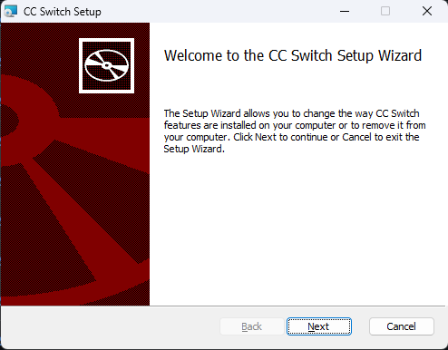
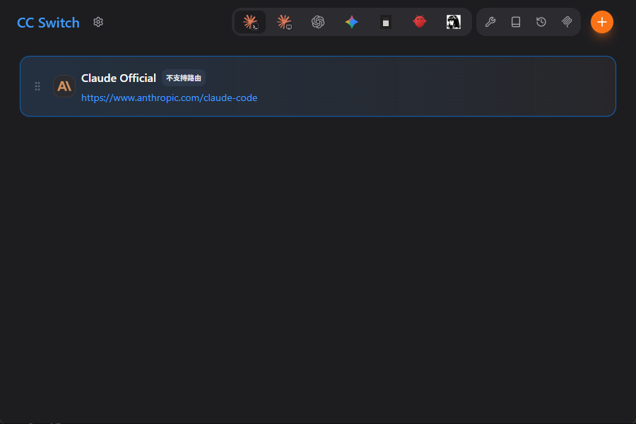
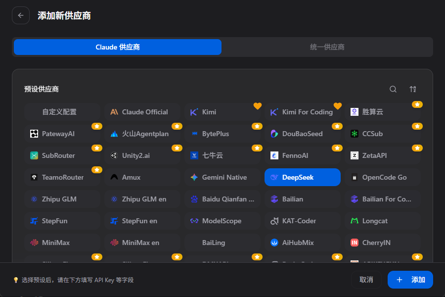
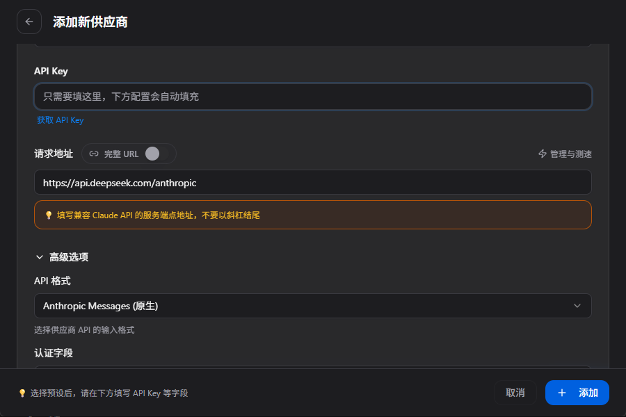
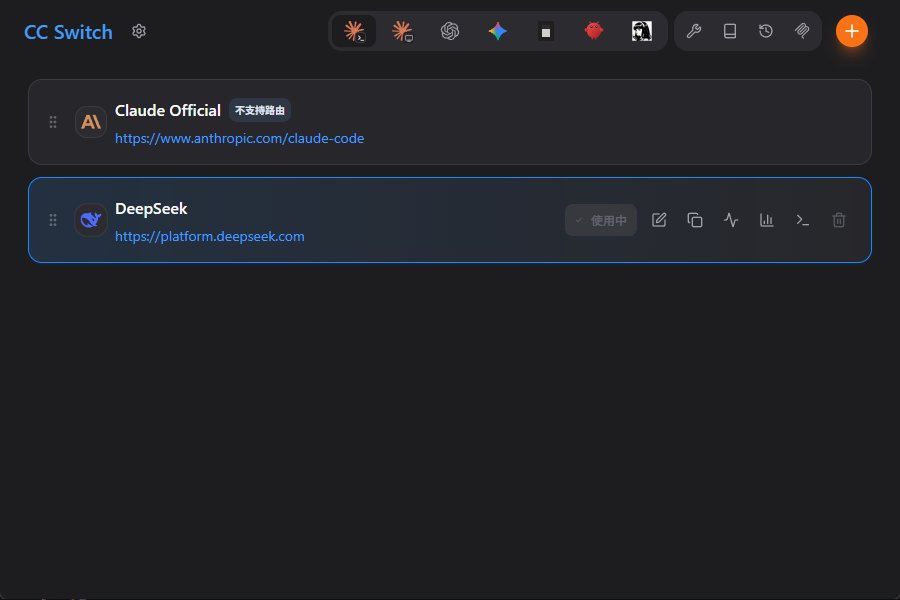
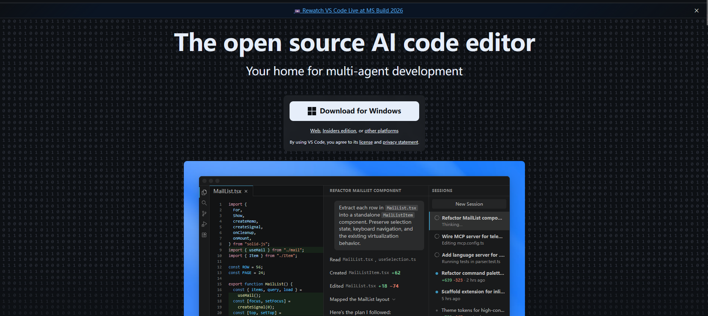
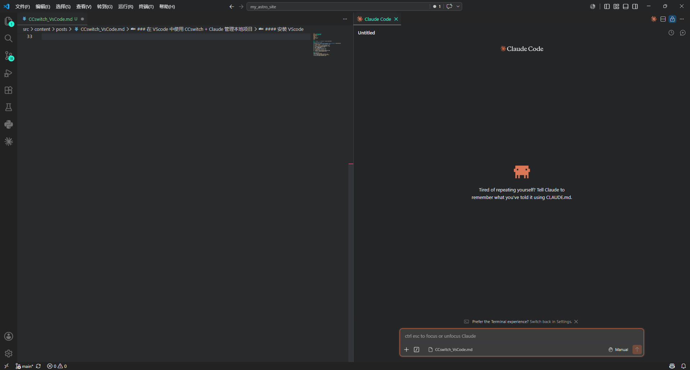

### 在 VScode 中使用 CCswitch + Claude 管理本地项目

#### 安装 CCswith 并配置
在[发布页](https://github.com/farion1231/cc-switch/releases)中安装对应版本。

打开**安装程序**。

打开安装好的 **CCswitch** 选择右上角添加按钮。

添加你要使用的运营商。

添加**apiKEY**。

添加完成后并使用，结束**CCswitch**的安装配置。

#### 安装 VScode
安装对应版本的**VScode**

在扩展中搜索并安装**CAnthropic.claude-code**

正在导航条右侧单击标志唤出**Claude**  

现在就已经配置完成了。
