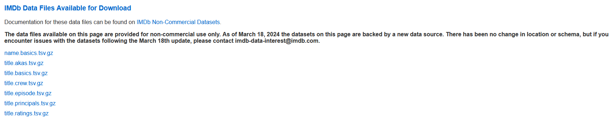
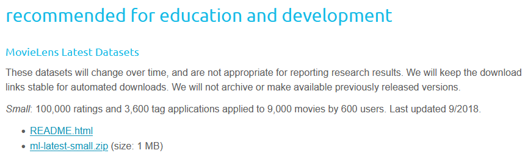

# 图学习 GSR 实验

## 1. 项目介绍
解决复杂网络信息的相似度的研究，为两个对象之间的关联性添加算法，以证明相似度的判断。
### 1.1 项目目标
- 通过特定算法对高权值的算法进行识别。
- 使相似度计算更符合语义。
- 使结果具有可解释性。
### 1.2 什么是GSR
对经典算法**SimRank**的改进，使其能够处理异构网络信息（处理各种不同类型的节点和关系），限制语义，将相似度的传播限制在相同的逻辑路径上，不会产生类似用作者和术语进行相似度比较的情况，过程透明化，步骤可追溯。
### 1.3 整理流程

---

## 2. 数据集

获取项目数据集

### 2.1 IMDb
从小数据集 **[IMDb Non-Commercial Datasets | IMDb Developer](https://developer.imdb.com/non-commercial-datasets/)** 开始，
获取数据集信息。

对下载完成的数据集进行解压，并对各个文件中的参数进行解释:  
- **title.akas.tsv:**
    - **titleld:** 唯一的标识符，指向`IMDb`数据库中特定的作品（Title），通常对应`title.basics.tsv`文件中的`tconst`。
 
    - **ordering:** 序号，用于对同一作品的多条记录进行排序，通常用来区分在该地区或语言下的不同标题优先级。

    - **title:** 具体的作品名称，即该地区或语言下使用的标题（如：电影的译名）。  

    - **region:** 标题适用的地区代码（通常使用 ISO 3166-1 alpha-2 国家/地区代码，例如 "US", "CN", "JP"），表示该名称在该地区使用。

    - **language:** 标题的语言代码（通常使用 ISO 639-1 代码，例如 "en", "zh"），表明标题所使用的语言。

    - **types**: 标题的类型，描述该标题的性质。例如：`alternative`（别名）、`dvd`（DVD发行名）、`festival`（电影节名称）、`original`（原始标题）等。

    - **attributes:** 标题的额外属性，用来提供关于该名称的更多上下文信息（例如："（译制片名）"或"（短片名）"等，如果无额外属性，通常显示为 `\N`。

    - **isOriginalTitle:** 布尔值（0 或 1），用于标识该标题是否为作品的原始标题（即作品创作时最原本的名称），1 表示是原始标题，0 表示不是。

- **title.basics.tsv:** 提供电影（Title）的基础信息。
    - **tconst:** 唯一标识符，是该作品在 IMDb 数据库中的主键（与 `title.akas.tsv` 中的 `titleId` 对应）。

    - **titleType:** 作品的类型，例如 `movie`（电影）、`short`（短片）、`tvSeries`（电视剧）或 `tvEpisode`（剧集）等。  
    
    - **primaryTitle:** 作品的首要标题，通常是该作品在原产国最常用的标题。  
    
    - **originalTitle:** 作品的原始标题，即作品制作时的原始名称，可能与首要标题不同。
    
    - **isAdult:** 布尔值，用于标识该作品是否属于成人内容（0 表示否，1 表示是）。
    
    - **startYear:** 作品发行或开始制作的年份（如果是电视剧，则为首播年份）。
    
    - **endYear:** 作品结束的年份（仅适用于系列剧集，若是单部电影或未完结作品通常显示为 `\N`）。
    
    - **runtimeMinutes:** 作品的运行时长（以分钟为单位）。
    
    - **genres:** 作品所属的流派或类型列表（例如 `Drama`,`Romance`），通常包含最多三个流派标签。

- **title.crew.tsv:** 提供电影的导演（Director）和编剧（Writer）信息。    
    - **tconst:** 唯一标识符，对应作品的 `ID`（与 `title.basics.tsv` 和其他数据文件中的标识符一致），将幕后职员与具体的作品关联起来。

    - **directors:** 该作品的导演列表，包含一个或多个 `nconst`（演员/职员 `ID`），多个导演之间用逗号分隔。
    
    - **writers:** 该作品的编剧列表，包含一个或多个 `nconst`（演员/职员 `ID`），多个编剧之间用逗号分隔。

- **title.episode.tsv:** 提供电视剧（`TV Series`）与剧集（`Episode`）之间的对应关系。   
    - **tconst:** 唯一标识符，代表具体的某一集内容。

    - **parentTconst:** 唯一标识符，代表该集所属的电视剧集（`Parent Title`，例如《老友记》的剧集 ID）。

    - **seasonNumber:** 整数，表示该集属于哪一个季度（`Season`）。
    
    - **episodeNumber:** 整数，表示该集在对应季度中的序号。

- **title.principals.tsv:** 提供电影与主要工作人员（演员、导演、编剧、制片人等）的对应关系。
    - **tconst:** 唯一标识符，对应作品的 `ID`（与 `title.basics.tsv` 和 `title.akas.tsv` 中的标识符一致），用来将演职员与具体的作品关联起来。

    - **ordering:** 序号，表示该演职员在作品职员表中的排列顺序。

    - **nconst:** 演职员的唯一标识符（`Name ID`），用于标识具体的演员、导演或编剧等（与 `name.basics.tsv` 对应）。

    - **category:** 演职员在作品中担任的类别或职位，例如 `actor`（演员）、`actress`（女演员）、`director`（导演）、`writer`（编剧）等。  

    - **job:** 具体的职位描述，如果该人员的职务较为细分（如“剪辑”、“摄影”），此字段会提供详细信息，否则通常显示为 `\N`。

    - **characters:** 该演职员在作品中扮演的角色名称列表（如果适用，以 JSON 格式存储；若是导演或制作人等非表演类职位，则显示为 `\N`）。

- **title.ratings.tsv:** 提供电影的 IMDb 用户评分信息。
    - **tconst:** 唯一标识符，对应作品的 `ID`，用于将评分数据关联到具体的作品。

    - **averageRating:** 该作品在 IMDb 平台上的加权平均评分（通常在 1 到 10 之间）。

    - **numVotes:** 参与评分的观众总人数，反映了该作品的流行度或关注度。

- **name.basics.tsv:** 提供人物（演员、导演、编剧等）的基础信息 
    
    - **nconst:** 唯一标识符，用于标识该人员，是连接演职员与其参与作品的核心键值（与 `title.principals.tsv` 中的 `nconst` 一致）。

    - **primaryName:** 该人员的常用姓名。
    
    - **birthYear:** 该人员的出生年份，若未知则显示为 `\N`。
    
    - **deathYear:** 该人员的去世年份，若在世或未知则显示为 `\N`。
    
    - **primaryProfession:** 该人员从事的主要职业，通常包含最多三个职业标签（例如 `director`,`writer`,`actor`）。
    
    - **knownForTitles:** 该人员最广为人知的代表作的 `tconst` 列表（以逗号分隔），反映了其职业生涯中的核心作品。
 

### 2.2 MovieLens
下载另一个数据集[MovieLens | GroupLens](https://grouplens.org/datasets/movielens/)，在这里由于设备硬件限制，我们选择最小的数据集(具有约约 9,000 部电影的共 10 万条用户评分记录)。

对文件中的参数进行解释:  
- **links.csv:** 提供 `MovieLens` 与 `IMDb` 电影 `ID` 的映射关系，用于关联电影信息和用户评分数据。  
    - **movieId:** `MovieLens` 数据集内部使用的电影唯一标识符，用于该平台内部的推荐或分析算法。

    - **imdbId:** 该电影在 `IMDb` 数据库中的唯一标识符，对应`title.basics.tsv` 等文件中的 `tconst`。
    
    - **tmdbId:** 该电影在 `TMDb` (`The Movie Database`) 平台上的唯一标识符，提供了另一套电影元数据来源。

- **movies.csv:** 提供通过`links.csv`才能找到对应的 `IMDb编号` ，以及电影标题，电影年号，电影类别。  
    - **movieId:** `MovieLens` 数据集内定义的电影唯一标识符，用于在该数据集中识别特定电影。

    - **title:** 电影的标题，通常包含电影名称及发行年份（例如 "Toy Story (1995)"）。
    
    - **genres:** 该电影所属的类型列表，通常以管道符 | 分隔多个类别（例如 "Animation|Children's|Comedy"）。
- **ratings.csv:** 存储用户对电影的评分记录，包括评分用户、评分电影、评分分数以及评分时间。  
    - **userId:** 用户的唯一标识符，代表在平台进行评分行为的具体个人

    - **movieId:** 电影的唯一标识符，对应之前提到的电影 ID，用于关联具体的作品。
    
    - **rating:** 用户给电影打出的分值（通常是 0.5 到 5.0 星），代表了用户对该电影的偏好程度。
    
    - **timestamp:** 用户打分的具体时间戳，用于记录行为发生的时序。

- **tags.csv:** 存储用户对电影添加的自定义标签，用于描述电影的特点或个人印象。
    - **userId:** 用户的唯一标识符，标记执行打标签动作的用户。

    - **movieId:** 电影的唯一标识符，标记被贴标签的目标电影。
    
    - **tag:** 用户定义的文本标签（例如“科幻”、“经典”、“烧脑”等），代表了用户对该电影的主观语义认知。
    
    - **timestamp:** 标签被添加的时间戳，记录了该语义关联形成的具体时间。

---

## 3 数据的预处理

### 3.1 提取数据
1. **处理`Movielens`数据集**，完成:
    - `userId`, `movieId`, `rating`, `timestamp`的提取。
    - `userId`, `movieId`, `tag`, `timestamp`的提取。
    - `movieId`, `title`, `genres`的提取。

2. 利用`MovieLens`的`link.csv`，在 **IMDb数据集** 中，获取电影的
`actor`（包含`actress`），`writer`，`producer`，`director`信息。

3. **提取规则:** 如果以上4类人，参与过2部以上电影保留该人物信息；
	然后，每部电影的演员不超过3个；writer，producer，director不超过2个。

> 此处以及下文均用 **C++** 进行代码演示

### 3.2 数据清洗
**清洗规则:** 每部电影的`actor`包含(`actress`)不超过**3**个，`writer`，`producer`，`director`不超过**2**个。

### 3.3 入库建表

---