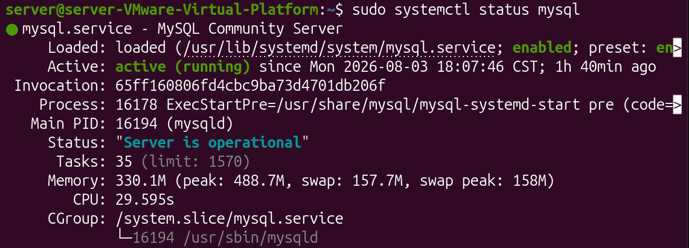

# 如何在 Ubuntu 下安装 MySql 并进行常规操作

## 安装 MySql
### 下载安装
在 Ubuntu 终端下执行安装:
```bash
sudo apt update
usdo apt install mysql-server
```
运行成功后，检查安装状态:
```bash
sudo systemctl status mysql
```
着重检查是否存在`active (running)`,

如果显示`active (running)`, 说明正常运行。

### 启动及设置开机自启

启动:
```bash
sudo systemctl start mysql
```
设置开机自启:
```bash
sudo systemctl enable mysql
```

## 基础操作
### 进入数据库
终端输入:
```bash
sudo mysql 
```
看到提示符变为:
```bash
mysql>
```
说明创建成功。

### 创建数据库
在 MySQL 中执行:
```bash
CREATE DATABASE YourSqlName;
```
以创建数据库。

### 查看已创建的数据库
在 MySQL 中执行:
```bash
SHOW DATABASES;
```
### 使用目标数据库
在 MySQL 中执行:
```bash
USE YourGoalSqlName;
```

### 在库中创建表
使用以下命令创建一个用户表:
```sql
CREATE TABLE users
(
    id INT AUTO_INCREMENT PRIMARY KEY,
    username VARCHAR(8) NOT NULL,
    password VARCHAR(12) NOT NULL
); 
```
#### 解释代码段
创建一个表，定义磁盘存储结构。
```sql
CREATE TABLE users
(

);
```
表中数据项:  
定义表中每条数据项; 第一行:
```sql
id INT AUTO_INCREMENT PRIMARY KEY
```
- `id` 变量名。
- `INT` 将类型定义为整数。
- `PRIMARY KEY` 设置唯一标识。
- `AUTO_INCREMENT` 设定自动增长，当没有插入该数据项时，自动插入。

第二、三行:
```sql
username VARCHAR(8) NOT NULL
```
- `username` 变量名。
- `VARRCHAR(8)` 字符串，最大长度 8 个字符。
- `NOT NULL` 不允许为空。

### 插入数据到表中
使用以下命令向表中插入数据:
```sql
INSERT INTO users(username, password)
VALUES
(
    'LINKONG',
    '12345678'
);
```
#### 解释代码段
`INSERT INTO` 插入数据到某个表中。格式:
```sql
INSERT INTO 表名(列1, 列2)
VALUES(值1, 值2);
``` 

### 查看表中的数据项
假设当前 login库 下的 users 表中结构为:
| id | username | password |
|:--:|:--:|:--:|
| 1 | LINKONG | 12345678 |
> 下文不再赘述。
#### 进入具体的的某个表
使用下面的语句进入需要查看数据的库:

```sql
SHOW DATABASES;
USE login;
```

使用下面的语句进入需要查看数据的表:
``` sql
SHOW TABLES;
USE login;
```
#### 查看表结构
产看表中包含哪些字段。
```sql
DESC users;
-- 或者
DESCRIBE users;
```
> 表结构对应创建时包含的数据项。
#### 查看表中的数据
使用以下语句查看表中全部数据:
```sql
SELECT * FROM users;
```
语句解释:
- `SELECT` 查询。
- `*` 范围, 此处表示所有列。
- `FROM xxx` 从 xxx 表中查询。

#### 查看某一、几列
只查看用户名:
```sql
SELECT username FROM users;
```
同时查看多个列
```sql
SELECT id,username FROM users;
```

#### 指定显示行数
查看前5行:
```sql
SELECT * FROM users LIMIT 5;
```
- `LIMIT 5` 返回最多5行。同时 `LIMIT` 还可以控制跳过的行数.
跳过10行, 然后显示5行:
```sql
SELECT * FROM users LIMIT 10,5;
```

#### 查看特定字段
只想要查看用户名:
```sql
SELECT username FROM users;
``` 
同时查看用户名和密码:
```sql
SELECT username, password FROM users; 
```
#### 带条件查询

查询用户名为 LINKONG 的用户:
```sql
SELECT * FROM users WHERE username = 'LINKONG';
```

同时查找用户名和密码:
```sql
SELECT * FROM users WHERE username='LINONG' AND password='12345678';
```

#### 查看表中所有数据数量
查看当前有多少用户:
```sql
SELECT COUNT(*) FROM users;
```

### 修改表中数据
修改某个用户的密码:
```sql
UPDATE users SET password='87654321' WHERE username='LINKONG';
```
### 删除表中数据
删除某个用户:
```sql
DELETE FROM users WHERE username='LINKONG';
```