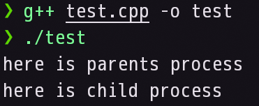
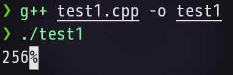
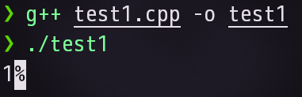
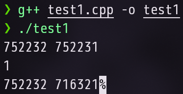

### 新进程的创建

调用`unistd.h`库中的`fork()`语句,会创建一个新的子进程，在单核中，CPU的调度列表上会有两个进程，原有的**父进程**与新创建出的**子进程**，两进程并发执行，互不干扰；但是在子进程中，子进程会进行标记，将自身PID标记成为0，用于身份区分。


调用`sys/types.h`库下的`pid_t`类型，来显式定义新变量的类型。  
*(在大多数linux计算机中`unistd.h`库会自动链接`sys/types.h`库)*


```c
#include <unistd.h>

int main(){

    pid_t pid = fork();
    //也可以使用 int 来进行定义，但是可能会出现PID超出int上限的情况

    return 0;
}
```

#### 测试是否出创建了两个进程
```cpp
#include <iostream>
#include <unistd.h>
#include <sys/types.h>

using namespace std;

int main(){
    pid_t pid = fork();
    
    if(pid == 0) cout << "here is child process" << endl;
    else cout << "here is parents process" << endl;
}
```

#### 查看编译结果:  
  
可以看到程序被父进程和子进程分别调用了一次。

### 自定义错误参数的返回
在进程创建的过程中，当今进程创建失败时会弹出报错消息，此时我们可以利用`unistd.h`库下的`perror`函数，来对报错消息进行自定义注释。
例如:`perror("进程创建失败!")`

### 父进程接收子进程的返回值
进程执行完毕后不会立即进行销毁，而是会进入类似阻塞状态并保留相对应的状态，因此需要调用`unitsd.h`库下的`exit()`函数进行资源解放。  
同时`sys/wait.h`库下的`wait()`函数常与`exit()`函数进行配套使用，在**父进程**中调用`wait()`函数会将父进程进行阻塞，此时父进程会等待子进程的结束，并尝试接收**子进程**中主动调用`exit()`函数的返回值。

```cpp
#include <iostream>
#include <unistd.h>
#include <sys/types.h>
#include <sys/wait.h>

using namespace std;

int main(){
    pid_t pid = fork();
    
    if(pid < 0){
        perror("进程创建失败!");
    }else if(pid == 0){
        exit(1);
    }else{
        int status;
        wait(&status);
        cout << status;
    }
}
```

#### 编译并运行:  
  
得到编译结果，此时我们发现返回值由**1**变成了**256**，这是因为内核为了在一个int类型中插入更多信息，因此对返回值进行了左移运算，左移了8位，因此从**00000000 00000001**变成了**00000001 00000000**，即从**1**变为了**256**。

我们可以使用宏进行逆向操作
`WEXITSTATUS()`。
此时可以得到正确的值:



### 如何获取PID
直接说结论:
- 获取自身PID: 在父进程中直接输出,在子进程中需要使用`getpid()`函数。    
- 获取父进程PID: 均需要使用`getppid()`函数。

对上文代码进行更新:
```cpp
#include <iostream>
#include <unistd.h>
#include <sys/types.h>
#include <sys/wait.h>

using namespace std;

int main(){
    pid_t pid = fork();
    
    if(pid < 0){
        perror("进程创建失败!");
    }else if(pid == 0){
        
    //new
        cout << getpid() << ' '
             << getppid() << endl;
        
        exit(1);
    }else{
        int status;
        wait(&status);
        cout << WEXITSTATUS(status);

    //new
        cout << pid << ' '
             << getppid();
    }
}
```

#### 查看编译结果:


可以看到已经成功打印了。