# 如何购买并使用云服务器

## 云服务提供商
国内云服务提供商常见的有：[腾讯云](https://cloud.tencent.com/)、[阿里云](https://www.aliyun.com)、[华为云](https://www.huaweicloud.com/)、[百度智能云](https://cloud.baidu.com/)、[京东云](https://www.jdcloud.com/)。

## 服务器的租赁
> 我们将用**腾讯云**来进行演示操作。
### 1. 进入到云服务提供商的官网。

### 2. 选择上方导航条中的产品类别，选择下拉列表中的**云服务器**。
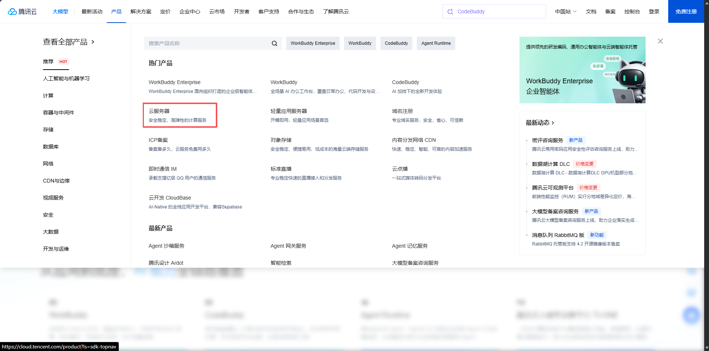

### 3. 进入如下选购页面。
同时向下划可以看到服务商已经提供了部分产品可供选择。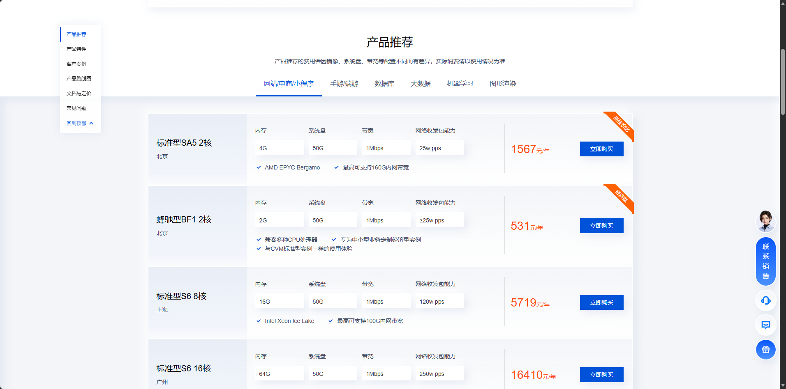

> 我们在这里主要演示如何按照自己的需求配置服务器，接下来我们需要明确需求。  
> 例如：  
> 用于高性能计算？还是作为后端运行程序？还是养虾？  
> 进一步对线程是否有要求？对内存是否有具体要求？还是需要高性能的显卡？  
> 以及是否需要频繁的网络上下行？

### 4. 明确需求：
演示示例  
- 适用于高性能计算
- 需要并行执行多道程序以缩短运行时间
- 矩阵的运行，需要庞大的内存空间来辅助计算
- 项目整体开支较小，不需要大量的硬盘来存储计算结果
- 只有上传项目的网络包花销，无需频繁发送网络包

点击**立即选购**进入到选购页面后选择**自定义配置**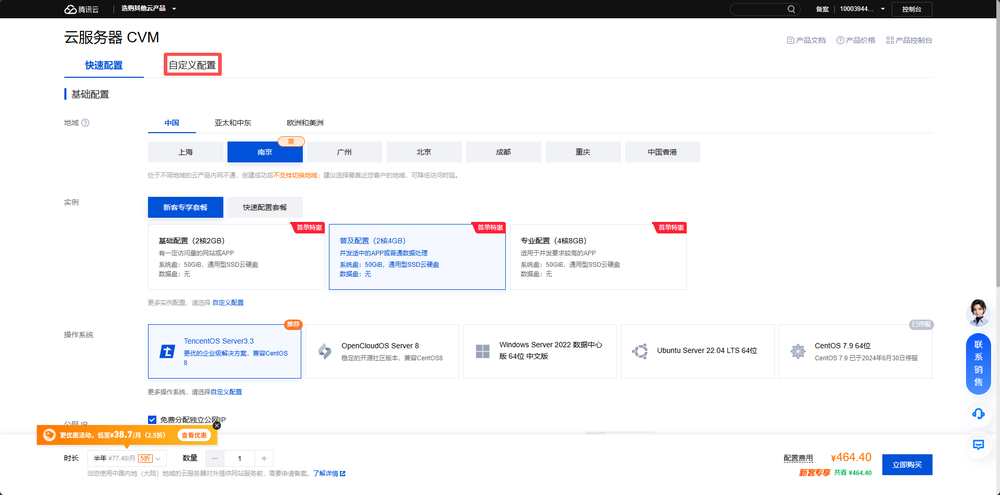进入到自定义配置界面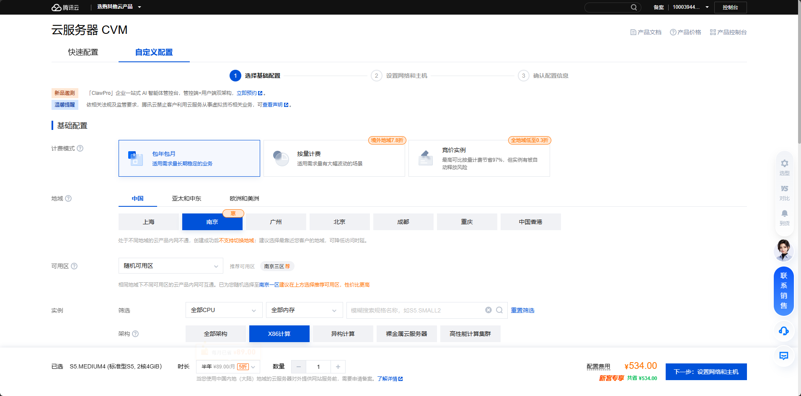
#### 4.1 选择计费模式
如果是长期需要运行在远端服务器的后端程序，建议选择包年包月；如果是为了高性能计算，结果的审核可以在本地处理的，则可以选择按量计算。我们因为是为了高性能计算选择按量计费。
#### 4.2 地域与可用区
无特殊要求默认即可
#### 4.3 配置选择
根据侧重选择不同的类型，比如在这里我们需要的内存比较多，可与选择内存型，然后在下方实力列表中进行选择即可。这里我们选择内存型MA9m进行演示。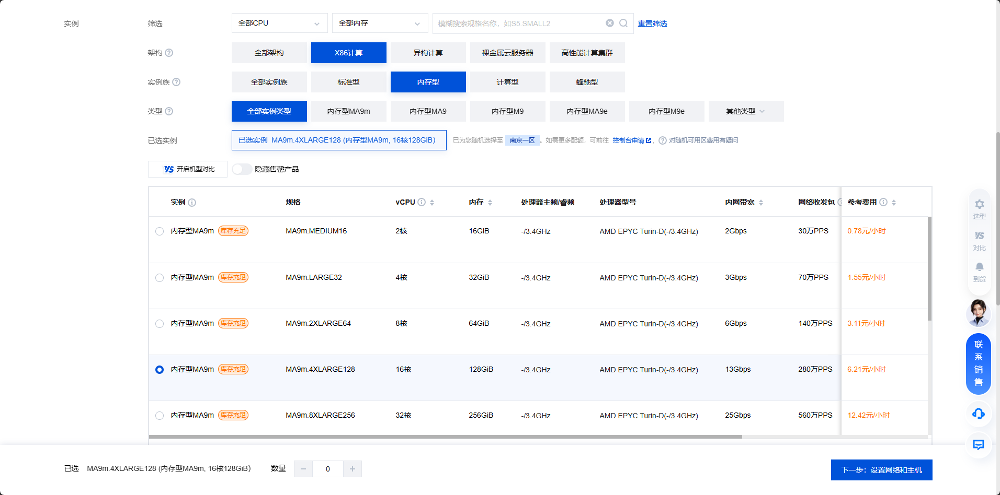
#### 4.4 选择系统镜像和存储
选择需要使用的系统(创建完成后可以重装系统)，因为系统盘已经足够使用，因此不额外添加数据盘。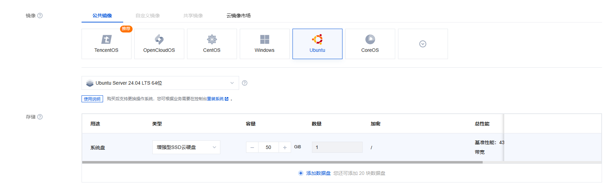选择完成后单机下一步，设置网络和主机。
#### 4.5 配置网络和主机
勾选 分配独立公网 IP 方便我们进行 SSH 连接到服务器，根据使用流量的多少来选择带宽计费模式，因为演示需求无需太高的收发包，因此选择 按流量计费 。同时根据使用需求设置贷款上限，越高带宽收发包速度越快。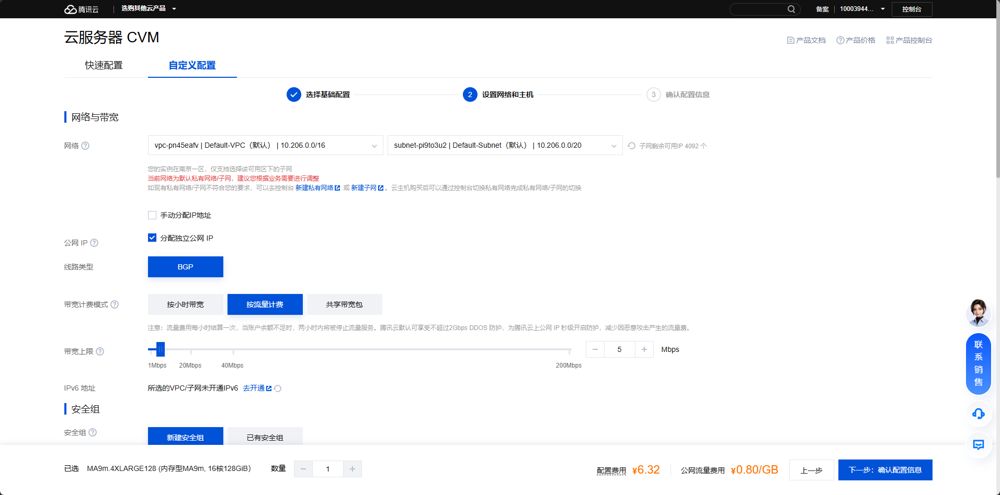
#### 4.6 开放部分端口
勾选开放ssh链接所需的22端口，以及ping命令的ICMP。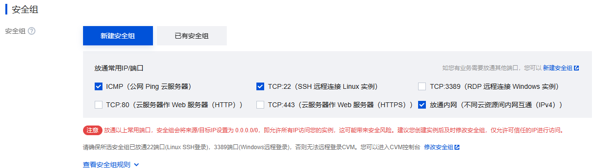
#### 4.7 设置登陆方式
设置链接到云服务器的登录密码其余设置默认即可。设置完成后点击下一步，确认配置信息。
#### 4.8 确认配置信息
可以看到我们的全部配置，如下图所示。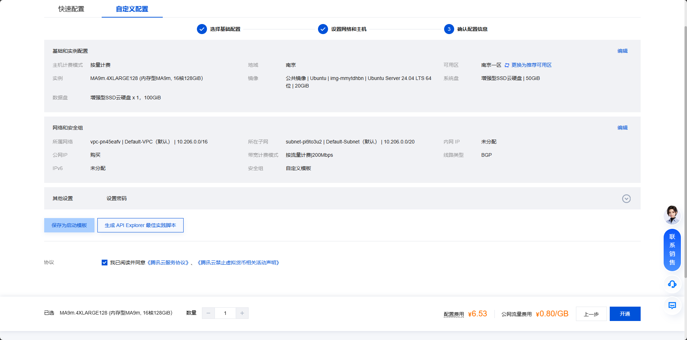如果准确无误点击开通，此时可能会提示需要先支付一定余额，按照提示充值即可。

## 链接到服务器
点击上方导航条中的 控制台 按钮。

进入产品控制台，选择我的资源中的云服务器。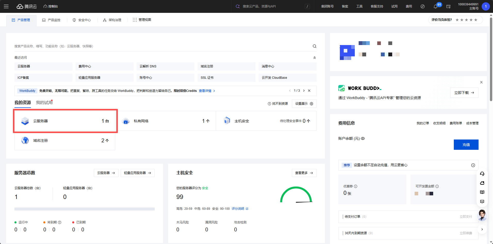

我们可以看到我们创建的云服务器。

记录下公网的IP地址，例如：

打开本地电脑的命令行工具，例如windows的cmd输入`ssh 用户名@ip地址`。
提示输入`yes`，然后输入密码，链接到云服务器，然后就可以像本地使用一样对云进行操作了。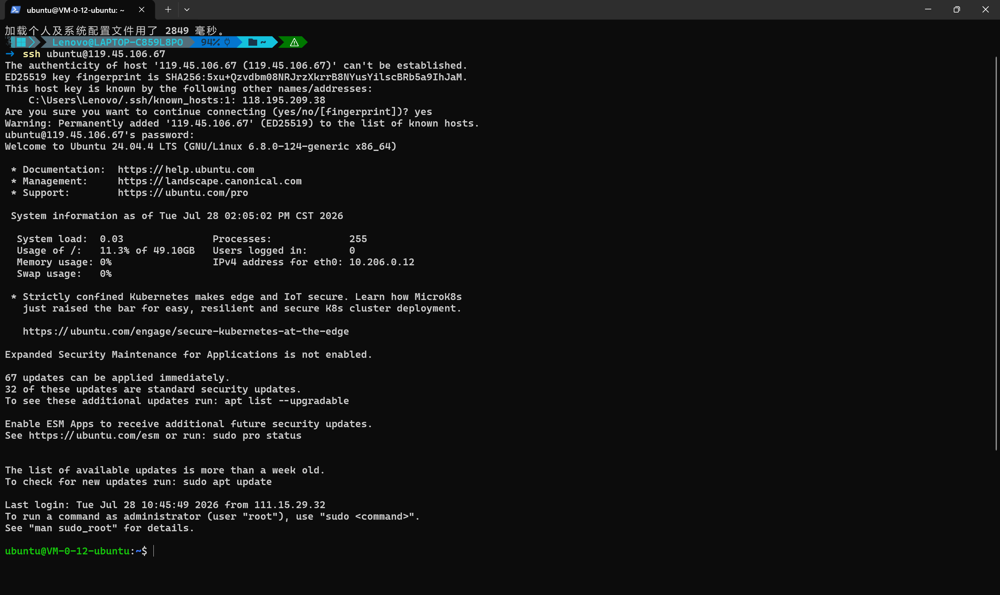